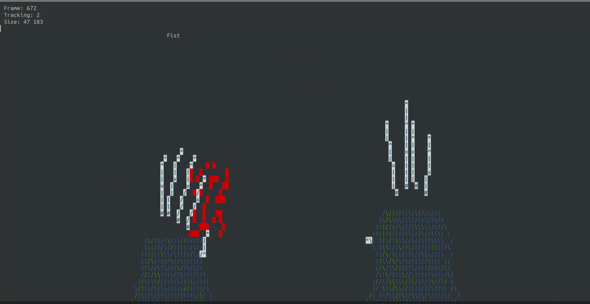

# Wizard tracking
A hacky project created during Ultraleap's internal hackathon. I enjoy the juxtaposition of using Ultraleap's high-tech hand tracking in an old-school curses based terminal app.

When run this app displays the user's hands in ASCII art complete with the procedurally generated sleeves of a wizard's robe. The user is prompted to strike poses with each of their hands and when satisfied an explosion effect is rendered 💥.

## Dependencies
I exclusively used Linux (specifically Ubuntu) when developing and testing this app. Tweaks will be needed to get it to build and run on other platforms. 
- `libcurses` On Ubuntu I installed the `libncurses-dev` package.
- `libLeapC` Install Ultraleap's hand tracking service. The CMake finder included in this repo should find the shared object.

## Hardware
Requires one of Ultraleap's cameras to be connected in desktop mode (tested with SIR170 and Leap 2).

## What's next?
I have lots of ideas on how to expand this which I might experiment with in the future:
- Have pose combinations perform specific spells
- Some kind of dungeon crawling with combat (not sure how I'd deal with player movement)
